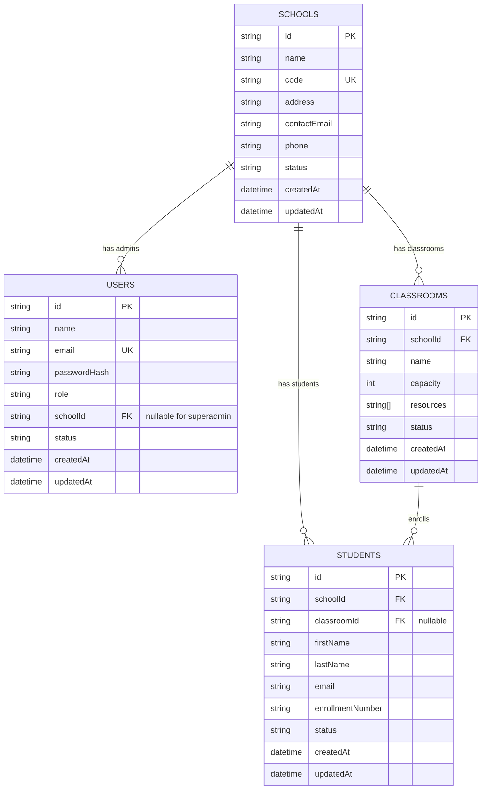

# Database Design

This service uses a **document-oriented key/value datastore**:

- Primary backend: **Redis**
- Fallback backend: **in-memory store** (same structure)

## 1. Logical Entity Design (Domain Model)



## 2. Physical Redis Keyspace Design

```mermaid
flowchart TD
    subgraph DOCS[Document Keys]
        D1[doc:users:{id}]
        D2[doc:schools:{id}]
        D3[doc:classrooms:{id}]
        D4[doc:students:{id}]
    end

    subgraph IDX[Index Sets]
        I1[idx:users]
        I2[idx:schools]
        I3[idx:classrooms]
        I4[idx:classrooms:bySchool:{schoolId}]
        I5[idx:students]
        I6[idx:students:bySchool:{schoolId}]
        I7[idx:students:byClassroom:{classroomId}]
    end

    subgraph KV[Uniqueness / Lookup Keys]
        K1[kv:userEmail:{email} -> userId]
        K2[kv:schoolCode:{code} -> schoolId]
        K3[kv:studentEmail:{schoolId}:{email} -> studentId]
        K4[kv:studentEnrollment:{schoolId}:{enrollment} -> studentId]
    end

    D1 --> I1
    D1 --> K1

    D2 --> I2
    D2 --> K2

    D3 --> I3
    D3 --> I4

    D4 --> I5
    D4 --> I6
    D4 --> I7
    D4 --> K3
    D4 --> K4
```

## 3. Constraint Notes

- `USERS.email` is globally unique via `kv:userEmail:{email}`.
- `SCHOOLS.code` is globally unique via `kv:schoolCode:{code}`.
- `STUDENTS.email` is unique **within a school** via `kv:studentEmail:{schoolId}:{email}`.
- `STUDENTS.enrollmentNumber` is unique **within a school** via `kv:studentEnrollment:{schoolId}:{enrollment}`.
- `STUDENTS.classroomId` is optional; students may exist without classroom assignment.
- Tokens are JWT-based and stateless; no token collection/table is persisted.
